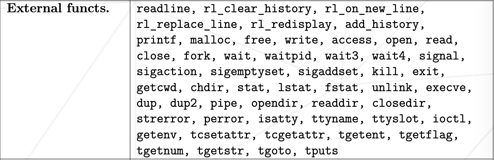
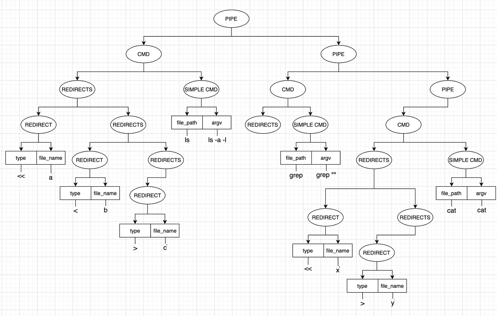

# Minishell
make bash-like shell  
이 프로젝트에서는 제한된 함수만 사용할 수 있습니다.  
* 함수목록

이 외의 필요한 함수는 구현해야합니다.
## IPC
IPC는 Inter Process Coumunication으로 프로세스 간 통신을 말합니다.  
* 파이프  
단일 방향 데이터 전송 메커니즘입니다. 일반적으로 부모와 자식 프로세스 간의 데이터 전송에 쓰입니다.
* 시그널  
프로세스에 비동기적으로 이벤트를 전달하는 메커니즘입니다. 시그널을 프로세스에 어떤 일이 발생했는지 알리는 데 쓰입니다.
* 소켓  
네트워크 프로토콜을 통해 두 프로세스가 통신할 수 있게 해주는 메커니즘입니다.
* 세마포어  
 여러 프로세스가 공유 리소스에 접근하는 것을 동기화하는 데 사용됩니다.
* 메시지 큐  
프로세스들이 메시지를 전송하고 받을 수 있는 큐를 제공합니다. 각 메시지는 주소가 있어 특정 프로세스로 전달될 수 있습니다. 

## 프롬포트
* readline
UNIX와 유사한 환경에서 명령줄 입력을 다루는 라이브러리입니다.  
readline함수를 통해 bash처럼 프롬포트를 띄울 수 있습니다.
* history
readline 라이브러리에 내장되어 있는 add_history 함수를 통해 사용자가 이전에 입력한 명령어를 기록하고 이전에 사용한 명령어들을 쉽게 재상용할 수 있도록 합니다.

## 파싱
파싱에는 순서가 있습니다.  
1. 어휘 분석 (lexical analysis)
어휘 분석 단계에서는 터미널에 들어온 입력 값들을 토큰화 시키는 과정을 수행합니다.  
예를 들어 ls -al < a | grep ""라는 입력이 올경우 문자열을 공백(space)를 기준으로 분리한 뒤 각 문자열에 맞게 의미를 부여합니다.  
명령어면 명령어, 파이프면 파이프라는 의미를 구조체를 만들어 부여합니다.  
2. 문법 분석 (syntax analysis)
문법 분석 방법에는 상향식 파싱, 하향식 파싱이 있습니다.  
그 중 재귀 하향 파서를 통해 구현하였습니다.  
문법 분석을 위해서는 기존에 있는 bash의 문법 구조에서 이 프로그램만의 문법구조가 필요합니다.  
Shell Grammer Rules를 참고하여 구현해야하는 문법을 가져와서 구현하였습니다. 
```
<pipeline>     ::= <cmd>
               |   <pipeline> '|' <cmd>

<and_or>       : '&&'
               | '||'

<cmd>          ::= <simple_cmd> 
               |   <simple_cmd> <redirects>

<simple_cmd>   ::= <file_path>
               |   <argv>

<subshell>     : '(' compound_list ')'

<argv>         ::= <file_path> <args>

<redirects>    ::= <io_redirect>
                |  <redirects> <io_redirect>

<io_redirect>  ::= '<'   <filename>
                |  '<<'  <filename>
                |  '>'   <filename>
                |  '>>'  <filename>

<args>        ::= WORD 
                | <args> WORD

<filename>    ::= WORD

<file_path>   ::= WORD
```
사용자가 입력하는 명령어들을 파싱하여야합니다.  
null, 세미콜론(;), 파이프(|), AND연산자(&&), OR연산자(||), 따옴표("",''), 괄호, 리다이렉트(<, <<, >, >>)을 기준으로 트리를 구성합니다.

```c
t_tree	*make_tree(t_tree *myself, t_dlist *dlist)
{
	t_dlist		*left;
	t_dlist		*right;
	t_dlist		*node;

	node = check_priority(dlist);
	if (!myself)
		myself = ft_calloc(1, sizeof(t_tree));
	myself->dlist = node;
	if (node->type >= 4)
		return (myself);
	left = node->prev;
	right = node->next;
	if (left)
		left->next = 0;
	if (right)
		right->prev = 0;
	left = get_first(node->prev);
	node->next = 0;
	node->prev = 0;
	if (left)
		myself->left_child = make_tree(myself->left_child, left);
	if (right)
		myself->right_child = make_tree(myself->right_child, right);
	return (myself);
}
```
각각의 토큰(노드)들의 우선순위를 파악하여 트리의 구성됩니다.  
예를 들어 가장 높은 우선순위인 &&, ||가 들어오면 루트 노드가 됩니다.  
그 이후 양 옆의 명령어들이 각각 왼쪽은 left child, 오른쪽은 right child로 트리가 구성됩니다.

## 명령어
* built-in 함수
구현 해야하는 함수들
 * echo
 * cd
 * pwd
 * export
 * unset
 * env
 * exit
* 일반 함수
예를 들어 ls 같은 함수들은 execve함수를 호출하여 환경변수에 저장되어있는 PATH를 통해 /bin/ls 처럼 실행합니다.  
단, execve함수는 리턴 시 프로세스가 종료되므로 자식프로세스에서 실행 후 반환값을 파이프를 통해 부모프로세스가 받아야합니다.


## 시그널
Ctrl+C(SIGINT), Ctrl+\(SIGQUIT), Crtl+D(SIGTERM)들의 시그널을 처리해야합니다.  
signal 함수를 호출하여 각각의 시그널들을 처리해주었습니다.

## 종료상태와 에러메시지
* 종료상태(exit status) $?
모든 명령어는 종료상태를 리턴합니다. 성공시에는 0, 실패시에는 에러코드로 해석될 수 있는 1 ~ 255를 리턴합니다.  
* 에러메시지
strerror(errno) 함수 호출을 통해 bash처럼 명령어 실행 실패 시 에러메시지를 출력할 수 있습니다.

## 파이프
* dup2()
```c
# include <unistd.h>
int dup2( int fd1, int fd2 ); 
```
파일 식별자를 복제해 fd2를 fd1으로 바꿉니다.  
예를 들어,
```c
int dup2( int fd1, int stdout ); 
```
같이 사용하면 모든 출력이 fd1으로 향하게 됩니다. 이를 통해 부모프로세스가 자식 프로세스에게 표준 입력으로 데이터를 줄 수 있습니다.
* 파이프
파이프의 양쪽 끝은 2개의 파일 디스크립터(fd)와 연결되어있습니다.  
하나는 데이터를 read하기 위한 것이고, 다른 하나는 데이터에 write하기 위한 것입니다.

* 파이프 구현 코드
```c
int	execute_pipe(t_info *info, t_tree *myself)
{
	int		i;
	int		in_fd;
	pid_t	left;
	pid_t	right;
	t_ftool	tool;

	in_fd = dup(STDIN_FILENO);
	pipe(tool.p_fd);
	i = 0;
	while (i < 2)
	{
		tool.pid = fork();
		if (!tool.pid)
			pipe_child_proc(info, myself, &tool, i);
		else
			pipe_parent_proc(&left, &right, &tool, i);
		i++;
	}
	dup2(in_fd, STDIN_FILENO);
	waitpid(left, &tool.status, 0);
	waitpid(right, &tool.status, 0);
	return (WEXITSTATUS(tool.status));
}
```
1. pipe를 통한 통신때문에 부모프로세스가 표준 입력을 잃어버립니다. 그러므로 표준입력을 dup함수를 통해 저장합니다. 
2. pipe 함수 호출을 통해 pipe를 만듭니다.
3. fork 함수 호출을 통해 자식프로세스를 생성후 자식프로세스의 아이디를 기록합니다.
4. 자식 프로세스에서는 tool.pid값이 0, 부모 프로세스에서는 tool.pid값으로 자식프로세스의 값을 가지고 있습니다. 이를 통해, 자식프로세스에서는 명령어 실행을,  부모프로세스에서는 파이프 정상 작동을 위한 fd close를 수행합니다.
5. 자식프로세스로 명령어 실행이 끝난 부모프로세스는 저장하고 있던 표준입력을 되찾습니다.
 
## 리다이렉션
리다이렉션에서도 dup2함수를 통해 구현됩니다.  
파이프와의 차이점은 표준입력, 표준출력을 넘겨주는 대상이 프로세스가 아니라 파일이라는 점입니다.